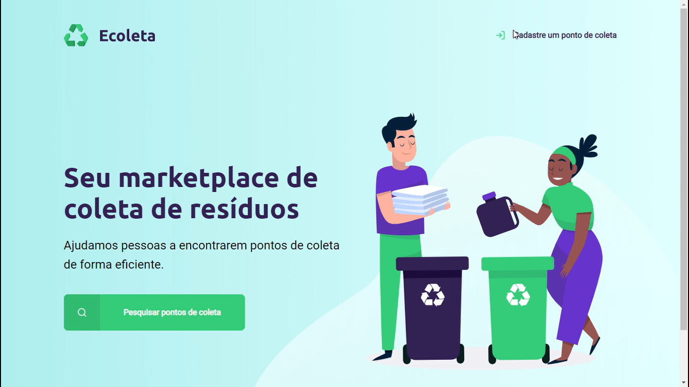
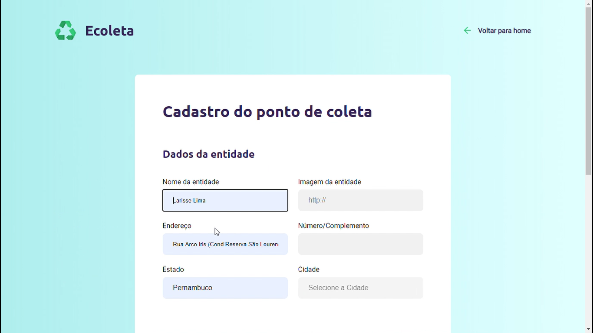
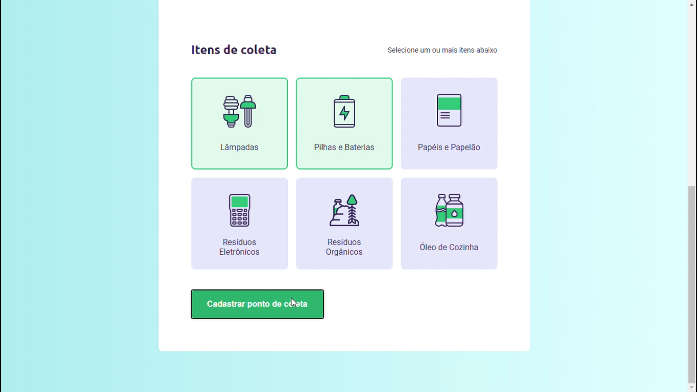
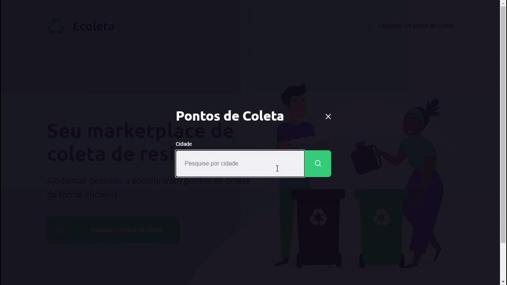
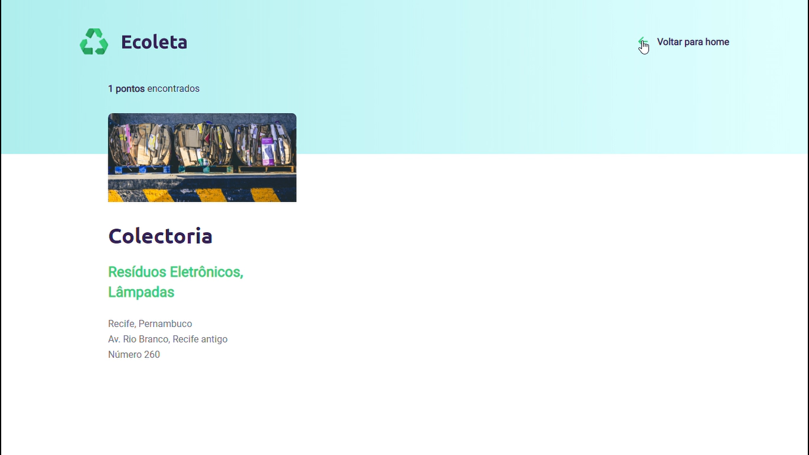

# NEXT LEVEL WEEK  

O projeto Ecoleta está sendo criado para gerenciar o processo de coleta de lixo nas cidades. Com ele, é possível ajudar pessoas a encontrarem pontos de coleta de uma forma mais eficiente. 

Linguagens utilizadas:
Html  
Css  
JavaScript  
Express 
Nunjucks 
Nodemon 
SQLite 
Node.js. 

[ LinkedIn ](https://www.linkedin.com/in/larisselima/)

Desenvolvido por Larisse Lima ☕ .
